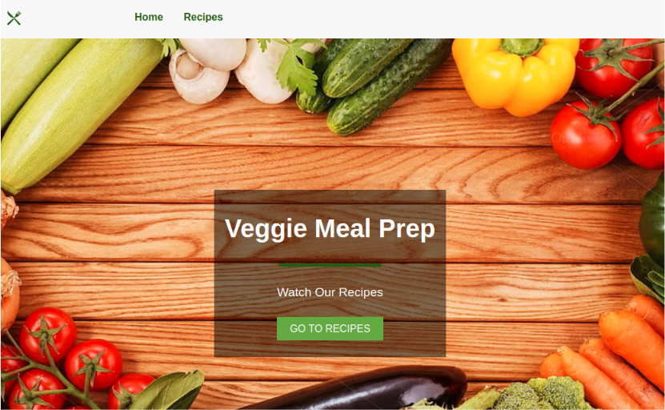

[![Issues][issues-shield]][issues-url]
[![LinkedIn][linkedin-shield]][linkedin-url]

<!-- PROJECT LOGO -->
<br />
<div align="center">
  <h3 align="center">React - Food</h3>
  
  <p align="center">Project created for <strong>Start2Impact</strong> course: <em>React project</em></p>
</div>

### Built With

* [HTML 5](https://developer.mozilla.org/en-US/docs/Glossary/HTML)
* [CSS 3](https://developer.mozilla.org/en-US/docs/Web/CSS)
* [Javascript](https://www.javascript.com/)
* [React](https://react.dev/)
* [Create React App](https://github.com/facebook/create-react-app)

<!-- TABLE OF CONTENTS -->
<details open="open">
  <summary>Table of Contents</summary>
  <ol>
    <li><a href="#getting-started">Getting Started</a></li>
    <li><a href="#usage">Usage</a></li>
    <li><a href="#contact">Contact</a></li>
  </ol>
</details>

<!-- GETTING STARTED -->
## Getting Started

1. Clone the repo

```sh
git clone https://github.com/matteorazzanelli/veggy-recipes-react.git
```

2. Rename the .env.sample in .env file and paste your api key from spoonacular there

3. Go to project folder and type

```sh
npm install && npm start
```

Runs the app in the development mode.\
Open [http://localhost:3000](http://localhost:3000) to view it in your browser.

The page will reload when you make changes.\
You may also see any lint errors in the console.

4. Type

```sh
npm run build
```

To builds the app for production to the `build` folder.\
It correctly bundles React in production mode and optimizes the build for the best performance.

<!-- USAGE -->
## Usage

- Simply press the "Go to the recipes" button and set your filters
- Then press "Go" and wait for your results
- Click for more info on a single recipe and taste it!


<!-- CONTACT -->
## Link & Contact

Matteo Razzanelli - matteo.razzanelli89@gmail.it

Start2impact personal page - https://talent.start2impact.it/profile/matteo-razzanelli

Project Repository: [React - Food App](https://github.com/matteorazzanelli/veggy-recipes-react)

Try the app [here](https://64e228e37de90c72216c41de--famous-pudding-8a97a4.netlify.app/)

<!-- MARKDOWN LINKS & IMAGES -->
[issues-shield]: https://img.shields.io/github/issues/matteorazzanelli/kreas-food-php/repo.svg?style=for-the-badge
[issues-url]: https://github.com/matteorazzanelli/veggy-recipes-react/issues
[linkedin-shield]: https://img.shields.io/badge/-LinkedIn-black.svg?style=for-the-badge&logo=linkedin&colorB=555
[linkedin-url]: https://www.linkedin.com/in/matteo-razzanelli/